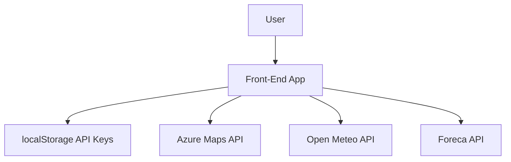
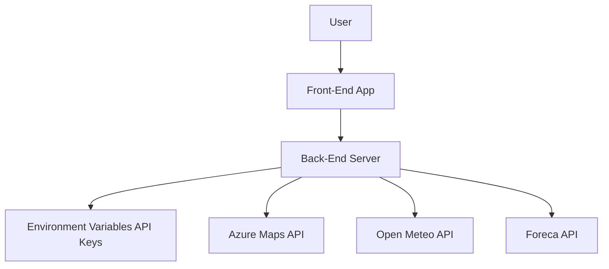
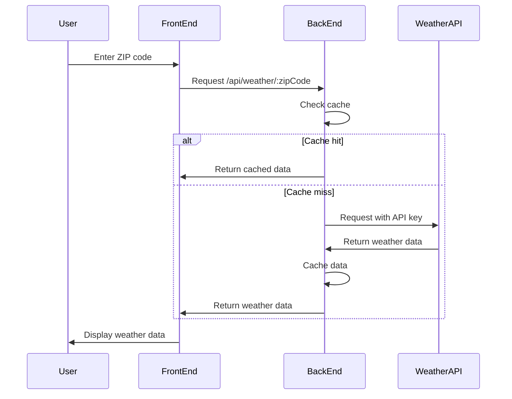

# API Key Management Migration Documentation

## 1. Migration Overview

### Summary of Changes
- Removed front-end API key management UI components
- Moved API key storage from client-side localStorage to server-side environment variables
- Created new back-end API endpoints for weather data fetching
- Updated front-end code to use the new back-end endpoints
- Added a migration notification for users

### Rationale for Migration
- **Security**: Protect API keys from exposure in client-side code and localStorage
- **Maintainability**: Centralize API key management on the server
- **User Experience**: Simplify the application by removing the need for users to manage API keys
- **Reliability**: Reduce errors related to invalid or missing API keys

### Benefits of the New Approach
- Enhanced security through server-side API key storage
- Simplified user experience with no API key management required
- Improved maintainability with centralized API management
- Better error handling and caching at the server level
- Consistent experience for all users

## 2. Technical Details

### Files Modified or Created

#### Modified Files
- `server.js`: Updated to include new API routes and security middleware
- `utils/apiKeyManager.js`: Deprecated front-end API key management
- `components/ApiKeyTester.jsx`: Updated for testing purposes
- `services/weatherService.js`: Updated to use back-end endpoints instead of direct API calls

#### Created Files
- `routes/weather.js`: New API endpoints for weather data
- `components/ApiMigrationNotice.jsx`: User notification about the migration
- `.env.example`: Template for server-side environment variables
- `tests/api-migration-tests.js`: Tests for verifying the migration
- `tests/API_MIGRATION_TESTING.md`: Documentation for testing the migration

### Key Changes in Each File

#### server.js
- Added security middleware (helmet) for protecting API endpoints
- Implemented rate limiting to prevent abuse
- Added routes for the new weather API endpoints
- Set up server-side caching with NodeCache

#### routes/weather.js
- Implemented endpoints for fetching weather data from multiple sources
- Created functions for interacting with each weather API provider
- Added caching logic to improve performance
- Implemented error handling for API requests

#### components/ApiMigrationNotice.jsx
- Created notification component to inform users about the migration
- Designed to display temporarily and auto-hide after 10 seconds

#### .env.example
- Added template for required environment variables
- Included placeholders for API keys and configuration settings

### Back-end API Endpoints

#### GET /api/weather/:zipCode
- **Purpose**: Fetch weather data for a specific ZIP code
- **Parameters**:
  - `zipCode`: 5-digit US ZIP code
  - `source` (optional): Weather data source (azuremaps, openmeteo, foreca)
- **Response**: JSON object containing weather data
- **Caching**: Results are cached for 1 hour by default

#### GET /api/weather/:zipCode/triple
- **Purpose**: Fetch weather data from all three sources for comparison
- **Parameters**:
  - `zipCode`: 5-digit US ZIP code
- **Response**: JSON array containing weather data from all sources
- **Caching**: Results are cached for 1 hour by default

#### POST /api/weather/cache/clear
- **Purpose**: Clear the server-side cache
- **Response**: Success message

### Front-end Interaction with Endpoints

The front-end now makes requests to back-end API endpoints instead of directly to weather service APIs:

```javascript
// Before migration
const weatherData = await fetchDirectFromWeatherAPI(zipCode, apiKey);

// After migration
const weatherData = await fetch(`/api/weather/${zipCode}`).then(res => res.json());
```

Key changes:
- API keys are no longer required in front-end code
- Error handling is simplified
- Caching is handled on the server side
- Multiple data sources are managed through a single interface

## 3. Security Improvements

### API Key Storage

#### Before Migration
- API keys stored in localStorage
- Visible in browser developer tools
- Accessible to any JavaScript running on the page
- Vulnerable to XSS attacks

#### After Migration
- API keys stored in server-side environment variables
- Not exposed in client-side code
- Not accessible through browser developer tools
- Protected from XSS attacks

### Security Comparison

| Aspect | Before Migration | After Migration |
|--------|-----------------|----------------|
| Storage Location | Browser localStorage | Server environment variables |
| Client-side Access | Fully accessible | No access |
| Exposure Risk | High | Low |
| XSS Vulnerability | High | Low |
| Key Rotation | Manual per user | Centralized |

### Best Practices Implemented

- **Environment Variables**: Using `.env` files for sensitive configuration
- **Security Headers**: Implementing helmet middleware for HTTP security headers
- **Rate Limiting**: Preventing abuse with express-rate-limit
- **CORS Configuration**: Controlling cross-origin requests
- **Error Handling**: Sanitizing error messages in production
- **Input Validation**: Validating ZIP codes and other inputs

## 4. Testing and Verification

### Testing Approach

A comprehensive testing strategy was implemented to verify the migration:

1. **Functional Testing**: Verifying core functionality works correctly
2. **Error Handling**: Testing application behavior under error conditions
3. **UI Testing**: Verifying UI changes and component removal
4. **Performance Testing**: Measuring load times and caching effectiveness
5. **Compatibility Testing**: Testing across browsers and device sizes

### Key Test Cases

#### Functional Tests
- Fetch weather data for valid ZIP code
- Triple-check mode with multiple data sources
- Caching functionality
- Recent ZIP codes tracking

#### Error Handling Tests
- Invalid ZIP code handling
- Server error simulation
- API service unavailability

#### UI Tests
- Verification of API key management UI removal
- Migration notification display

#### Performance Tests
- Load time measurements
- Caching improvement metrics

### Verification Methods

- **Automated Tests**: Using the test runner at `/tests/api-migration-test-runner.html`
- **Manual Testing**: Following the checklist in `/tests/API_MIGRATION_TESTING.md`
- **Browser Testing**: Verifying functionality across Chrome, Firefox, Safari, and Edge
- **Responsive Testing**: Checking display on desktop, tablet, and mobile devices

## 5. User Impact

### Changes to User Experience

- **Simplified Interface**: Removed API key management UI components
- **Reduced Complexity**: Users no longer need to obtain or manage API keys
- **Consistent Experience**: All users get the same experience without configuration
- **Improved Reliability**: Fewer errors related to invalid or missing API keys

### User Notification

Users are informed about the migration through a notification banner:

- Displays automatically when the application loads
- Contains a clear message about the API key management change
- Auto-hides after 10 seconds
- Can be manually dismissed

The notification message states:
> "API keys are now managed securely on the server side. You no longer need to enter or manage your API keys manually."

### Required User Actions

- **No action required** from users
- Previous API keys entered by users are no longer used
- Users do not need to clear or update any settings

## 6. Maintenance Guidelines

### API Key Management

#### Adding or Updating API Keys
1. Access the server where the application is deployed
2. Edit the `.env` file
3. Update the relevant API key variables:
   ```
   AZURE_MAPS_API_KEY=your_new_key_here
   FORECA_API_KEY=your_new_key_here
   ```
4. Save the file and restart the server

#### API Key Rotation
1. Obtain new API keys from the service providers
2. Update the `.env` file as described above
3. Test the application to ensure the new keys work correctly
4. Revoke the old API keys once the new ones are confirmed working

### Troubleshooting Common Issues

#### API Errors
- Check server logs for detailed error messages
- Verify API keys are correctly set in the `.env` file
- Test API endpoints directly using tools like Postman or curl
- Check if the API service is experiencing downtime

#### Caching Issues
- Clear the server-side cache using the `/api/weather/cache/clear` endpoint
- Restart the server to reset the cache
- Check cache configuration in `server.js`

#### Performance Issues
- Monitor server response times
- Check for rate limiting by API providers
- Consider adjusting cache TTL values

### Recommendations for Future Improvements

- **API Key Rotation System**: Implement automatic key rotation
- **Admin Interface**: Create a secure admin interface for managing API keys
- **Fallback Mechanisms**: Implement better fallback when a service is unavailable
- **Monitoring**: Add monitoring for API usage and errors
- **Analytics**: Track API usage patterns to optimize caching

## Architecture Diagrams

### Before Migration Architecture



### After Migration Architecture



### API Request Flow



## Conclusion

The API key management migration represents a significant improvement in the Super Sky App's security, maintainability, and user experience. By moving API key management to the server side, we've eliminated a common source of user friction and potential security vulnerabilities.

This documentation serves as a comprehensive reference for understanding the changes made, the rationale behind them, and how to maintain the system going forward. It should be useful for both current developers and future maintainers of the application.